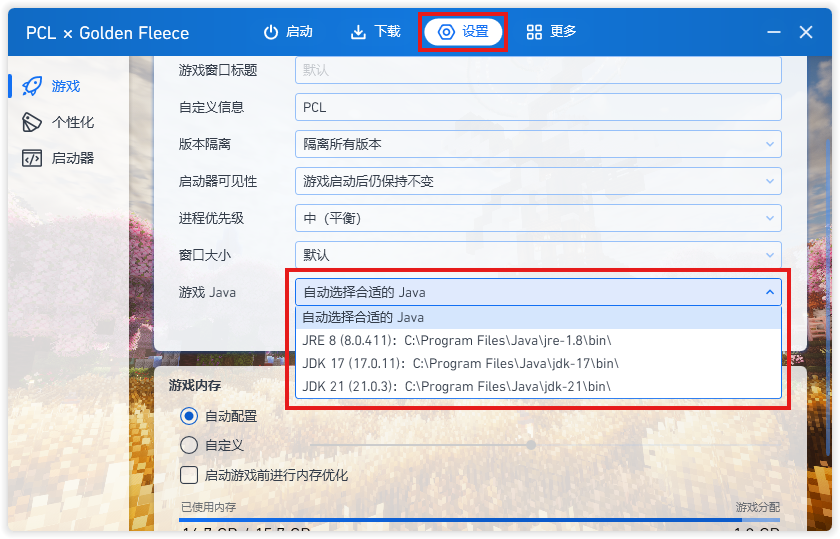
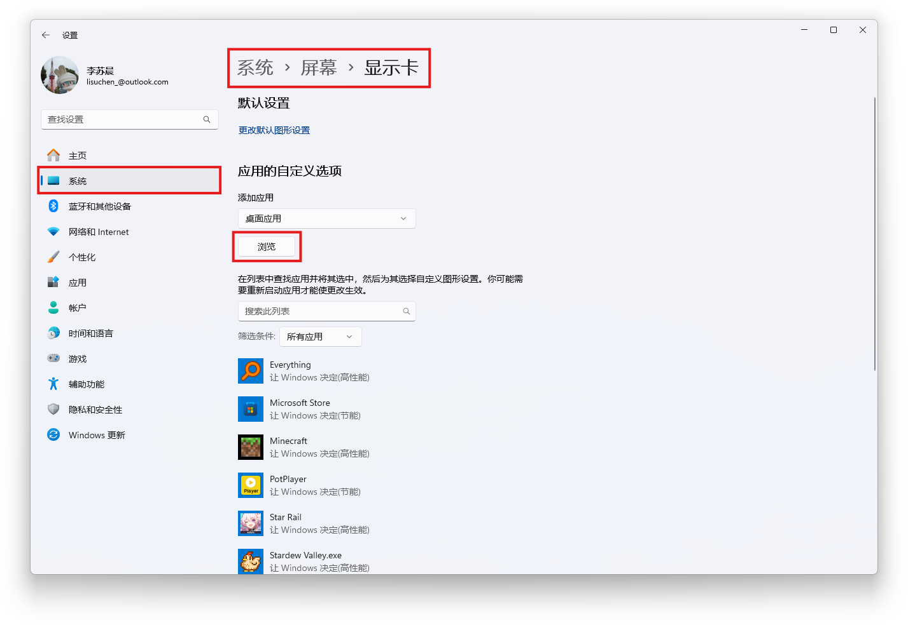
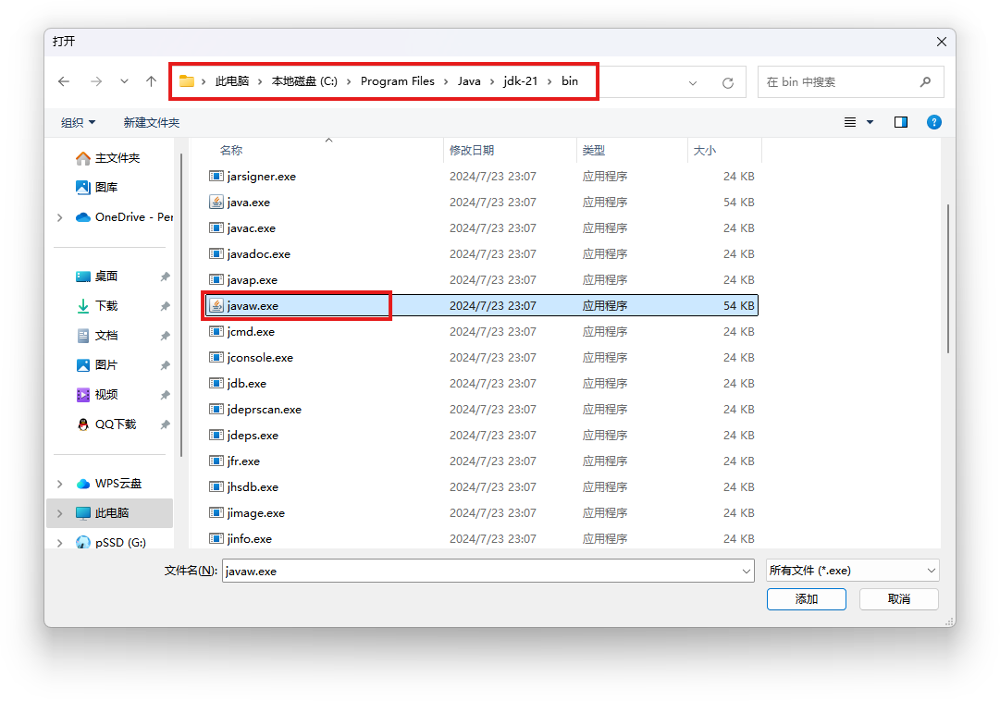
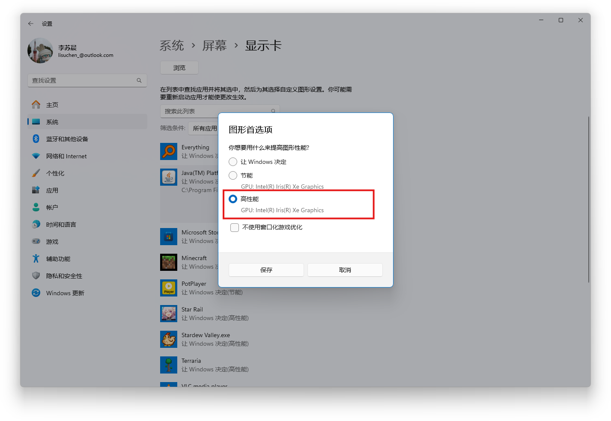

## 显卡驱动错误

------

#### 👉问题：

PCL启动游戏时显示显卡驱动错误，需要你更新驱动

#### 👉原因：

显卡驱动过旧导致一些优化MOD无法正常加载

#### 👉解决：

⭕N卡：群文件→常见解决方案→Nvidia APP→安装→更新驱动程序

⭕A卡：任务栏右下角托盘→AMD Software→驱动程序和软件（检查更新）

⭕如更新显卡驱动仍无法解决，大概率为AMD核显问题，根据以下步骤操作

🔷PCL 设置→游戏 Java →记住 Java 的文件路径*（一般为 C:\Program Files\Java）*

🔷系统设置→系统→屏幕→显示卡→添加桌面应用

🔷根据文件路径找到 javaw.exe 文件

🔷将其改为高性能*（即独立显卡）*

