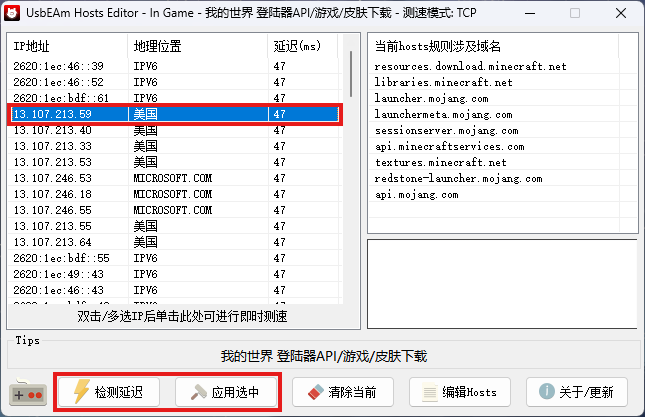

## 网络错误&无法连接验证服务器

------

#### 👉问题：

PCL启动游戏时显示网络错误，游戏内显示无法连接验证服务器

#### 👉原因：

微软抽风，导致无法连接至Xbox正版验证服务器

#### 👉解决：

⭕重启客户端，重启PCL，重启电脑

⭕使用加速器加速Xbox、微软或Minecraft

⭕如以上方法仍无法解决，根据以下步骤操作

🔷群文件→常见解决方案→UsbEAm Hosts Editor v3.63.zip

🔷解压→打开 UsbEAm Hosts Editor v3.63.

🔷根据图示添加登陆器API

🔷检测延迟→选择延迟最低的地址→应用选中

