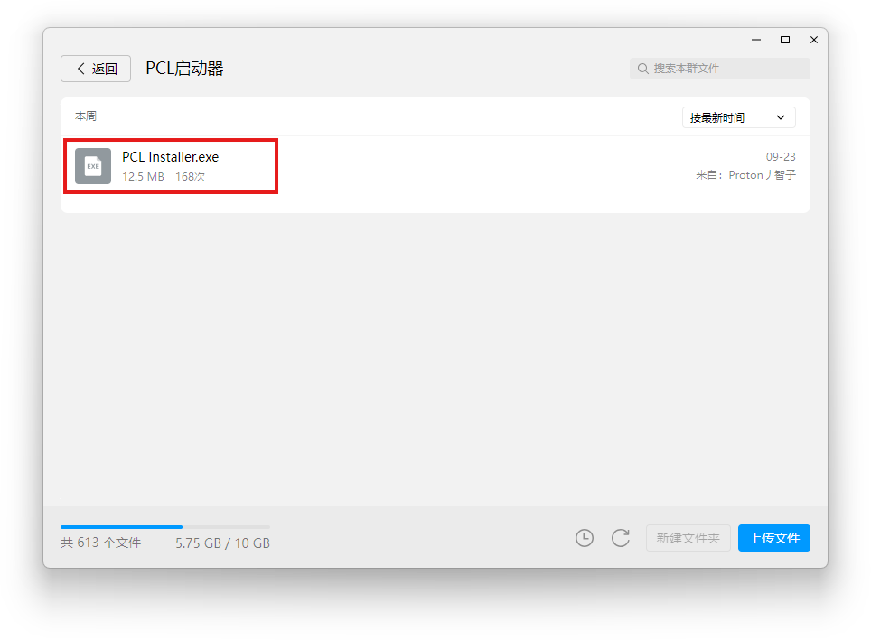
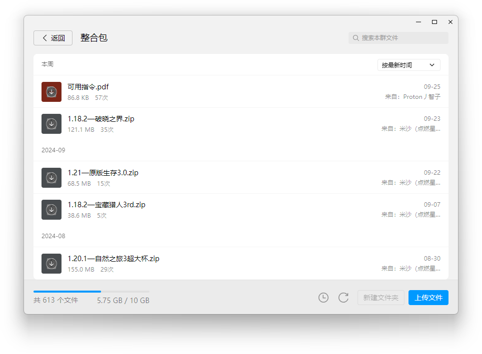
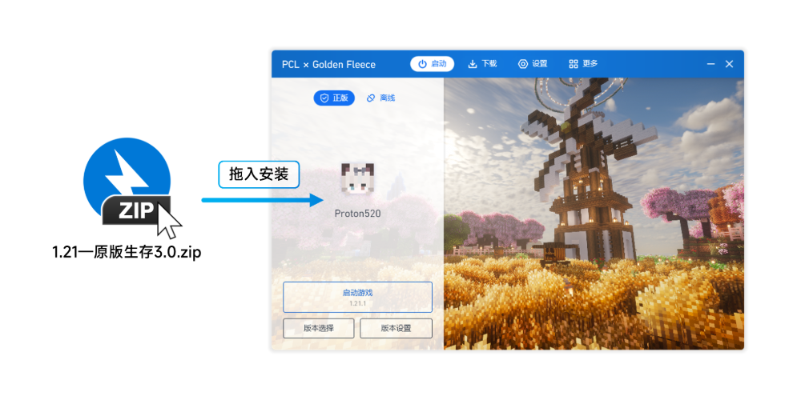
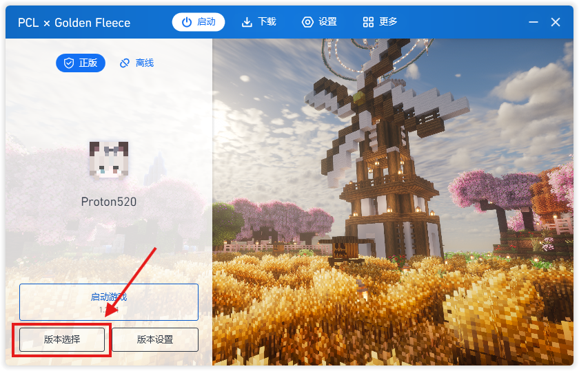
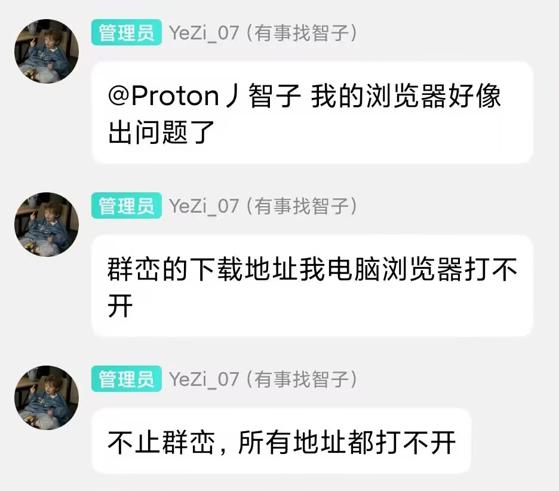

## 使用整合包加入服务器

#### 下载启动器

在 [QQ群](https://qm.qq.com/q/A7oSGnLHCE) 群文件的`PCL启动器`文件夹中，下载 `PCL Installer` 并安装。

?> Tip: 如果已有启动器，可忽略此步骤。

#### 下载整合包

在 [QQ群](https://qm.qq.com/q/A7oSGnLHCE) 群文件的`整合包`文件夹中，下载对应服务器的整合包。

?> Tip: 可以顺便看一下可用指令哦 (●'◡'●)

#### 安装整合包

将下载好的整合包`直接拖动`至 PCL 启动器窗口，进行安装。

#### 选择版本

整合包安装成功后，点击`版本选择`，选择刚刚安装好的版本，即可进行游玩。

?> Tip: 原版生存还需要填写置顶群公告白名单收集表，模组服记得登录正版账号哦🎉

> 注意：请勿将服务器地址直接输入到浏览器地址栏！ 

